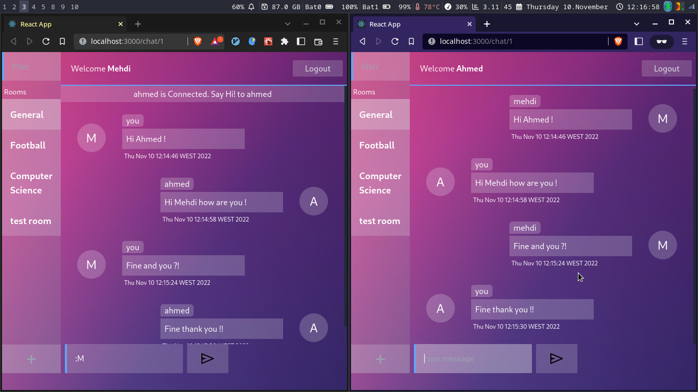

OpenHangout
==
Realtime multi client chat application with a JakartaEE/JEE backend and a ReactJS client for the web and a JavaFX client for the desktop.

---

## Frontend

## Backend


## Notice: 
This application is meant for demonstration purposes.
this application demonstrates how we can use JavaEE to build modern service oriented applications.

## How to run the application
### run the backend
```shell
cd openhangout
```
```shell
mvn clean package
```
```shell
mvn jetty:run
```
### run the frontend
```shell
cd openhangout-react-client
```
```shell
npm i
```
```shell
npm start
```


## Application Components
- **Jersey**: a JAX-RS implementation for building REST APIs.
- **Jetty Websockets**: a websockets implementation for buidling realtime applications.
- **JDBC** for data persistence.


## TODO:
- persist messages
- resolve Heroku websockets deployment issues and deploy the application to the web.
- build the desktop client.
- close DB connections in finaly block


